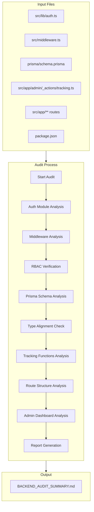

# Design Document: Backend Audit & Architecture Verification

## Overview

This design describes a systematic audit process for a Next.js 16 application using Auth.js v5, Prisma 5, and TypeScript. The audit will analyze authentication, database schema, routing, tracking functions, and admin dashboard components to produce an actionable Markdown report.

The audit follows a structured approach:
1. Static analysis of configuration files and code patterns
2. Cross-referencing between Prisma models and TypeScript types
3. Verification of route protection against intended access levels
4. Validation of tracking function signatures against actual usage
5. Generation of a phased remediation plan

### Tech Stack Versions (from package.json)
- Next.js: ^16.0.8
- next-auth: ^5.0.0-beta.30
- @auth/prisma-adapter: ^2.11.1
- @prisma/client: ^5.12.0
- prisma: ^5.12.0

## Architecture



## Components and Interfaces

### 1. Auth Module Analyzer

Analyzes `src/lib/auth.ts` for Auth.js v5 compliance.

```typescript
interface AuthAuditResult {
  configValid: boolean;
  issues: AuthIssue[];
  recommendations: string[];
}

interface AuthIssue {
  location: string;
  severity: 'error' | 'warning' | 'info';
  description: string;
  fix?: string;
}
```

### 2. Middleware Analyzer

Analyzes `src/middleware.ts` for correct Auth.js v5 integration.

```typescript
interface MiddlewareAuditResult {
  exportValid: boolean;
  matcherValid: boolean;
  edgeCompatible: boolean;
  issues: MiddlewareIssue[];
}
```

### 3. RBAC Verifier

Verifies role-based access control implementation.

```typescript
interface RBACVerificationResult {
  publicRoutes: RouteCheck[];
  userRoutes: RouteCheck[];
  adminRoutes: RouteCheck[];
  vulnerabilities: RBACVulnerability[];
}
```

### 4. Prisma Schema Analyzer

Analyzes `prisma/schema.prisma` for correctness and type alignment.

```typescript
interface PrismaAuditResult {
  models: ModelAnalysis[];
  enums: EnumAnalysis[];
  relations: RelationAnalysis[];
  clientConfig: ClientConfigAnalysis;
}
```

### 5. Tracking Functions Analyzer

Analyzes server actions in `src/app/admin/_actions/tracking.ts`.

```typescript
interface TrackingAuditResult {
  functions: TrackingFunctionAnalysis[];
  usageIssues: UsageIssue[];
}
```

### 6. Route Structure Analyzer

Analyzes App Router structure under `src/app/**`.

```typescript
interface RouteAuditResult {
  routes: RouteAnalysis[];
  layoutGuards: LayoutGuardAnalysis[];
  missingProtection: string[];
  overProtected: string[];
}
```

### 7. User Dashboard Analyzer

Analyzes `src/app/account/page.tsx` for user dashboard structure and data flow.

```typescript
interface UserDashboardAuditResult {
  tabs: UserTabAnalysis[];
  dataQueries: DataQueryAnalysis[];
  authGuard: AuthGuardAnalysis;
  issues: string[];
}

interface UserTabAnalysis {
  name: string; // profile, quotes, cart, orders, notifications
  dataSource: 'prisma-direct' | 'api' | 'server-action';
  hasData: boolean;
  status: 'ok' | 'incomplete' | 'missing';
}

// User Dashboard Structure (from src/app/account/page.tsx):
// - Server Component with auth() guard
// - Tabs: Profile, Quotes, Cart, Orders, Notifications
// - Data fetched via getUserData() using direct Prisma queries
// - Displays: user info, company, addresses, quotes, cart items, notifications
```

### 8. Form Submissions Analyzer

Analyzes form submission flow across the application.

```typescript
interface FormSubmissionAuditResult {
  formTypes: FormTypeAnalysis[];
  trackingIntegration: boolean;
  adminVisibility: boolean;
  issues: string[];
}

interface FormTypeAnalysis {
  type: 'contact' | 'inquiry' | 'quote' | 'newsletter' | 'custom';
  hasValidation: boolean;
  trackedCorrectly: boolean;
  storedInPrisma: boolean;
}

// Form Submission Flow:
// 1. User submits form → trackFormSubmission() server action
// 2. Creates FormSubmission record in Prisma
// 3. Creates AnalyticsEvent record
// 4. Creates AdminNotification
// 5. Revalidates /admin/forms path
```

### 9. Order Dashboard Analyzer

Analyzes `src/components/order-dashboard.tsx` for order/quote management.

```typescript
interface OrderDashboardAuditResult {
  dataSource: string; // /api/admin/orders
  statsDisplayed: string[];
  tableColumns: string[];
  issues: string[];
}

// Order Dashboard Structure:
// - Client Component fetching from /api/admin/orders
// - Stats: totalOrders, pendingOrders, totalValue, completionRate
// - Table: reference, email, items, date, status, total
// - Note: "Orders" are actually Quotes in this system
```

### 10. Report Generator

Generates the final Markdown audit report.

```typescript
interface AuditReport {
  overview: OverviewSection;
  authAudit: AuthAuditSection;
  prismaAudit: PrismaAuditSection;
  trackingAudit: TrackingAuditSection;
  routingAudit: RoutingAuditSection;
  userDashboardAudit: UserDashboardAuditSection;
  formSubmissionAudit: FormSubmissionAuditSection;
  actionPlan: ActionPlanSection;
}
```

## Data Models

The audit process works with the existing Prisma schema. Key models:

### Authentication Models
- **User**: Core user model with role (ADMIN/CUSTOMER), email, password, lastLogin
- **Company**: Optional company association for B2B users

### Tracking Models
- **AnalyticsEvent**: Generic event tracking with eventType and eventData (JSON)
- **ProductView**: Product view tracking with optional userId
- **SearchQuery**: Search query tracking with results count
- **FormSubmission**: Form submission tracking with formType and data (JSON)
- **NewsletterSubscriber**: Newsletter subscription tracking
- **Notification**: User notifications
- **AdminNotification**: Admin-specific notifications

### User Dashboard Models
- **Quote**: User quote requests with status workflow (DRAFT, PENDING, NEGOTIATING, ACCEPTED, REJECTED, EXPIRED)
- **QuoteLine**: Individual line items in quotes
- **CartItem**: Shopping cart items linked to users and products
- **Address**: User/company addresses (BILLING, SHIPPING)

### Form Submission Types
The system supports multiple form types tracked via `trackFormSubmission()`:
- `contact` - Contact form submissions
- `inquiry` - Product/service inquiries
- `quote` - Quote request forms
- `newsletter` - Newsletter signups (also tracked separately)
- `custom` - Custom form types


## Correctness Properties

*A property is a characteristic or behavior that should hold true across all valid executions of a system—essentially, a formal statement about what the system should do. Properties serve as the bridge between human-readable specifications and machine-verifiable correctness guarantees.*

### Property 1: Role Propagation Through Callbacks

*For any* user with a defined role (ADMIN or CUSTOMER), when that user authenticates and the jwt and session callbacks execute, the role value in the final session object SHALL match the user's database role exactly.

**Validates: Requirements 1.3**

### Property 2: Route Protection Correctness

*For any* route path and user authentication state (unauthenticated, CUSTOMER role, ADMIN role), the authorized callback SHALL return the correct access decision:
- Public routes (/, /products/**, /quote, /guest-quote, /newsletter, /contact, /auth/**) → allow all
- User routes (/account, /checkout) → require authentication, allow both roles
- Admin routes (/admin/**) → require ADMIN role only

**Validates: Requirements 2.2, 2.4, 3.1, 3.2, 3.3, 6.1, 6.2**

### Property 3: Prisma Schema Alignment

*For any* Prisma model field, there SHALL exist a corresponding TypeScript type field with matching name and compatible type. *For any* Prisma enum, there SHALL exist a corresponding TypeScript type with matching values.

**Validates: Requirements 4.1, 4.2, 4.5**

### Property 4: Tracking Function Parameter Correctness

*For any* call to a tracking function (trackCheckoutEvent, trackUserRegistration, trackQuoteRequest, trackNewsletterSignup, trackFormSubmission, trackProductView, trackSearchQuery, createNotification, updateUserLastLogin), the provided parameters SHALL match the function's expected input shape.

**Validates: Requirements 5.2, 5.4**

### Property 5: Tracking Function Prisma Write Correctness

*For any* tracking function execution with valid parameters, the function SHALL create records in the correct Prisma models:
- trackCheckoutEvent → AnalyticsEvent, AdminNotification
- trackUserRegistration → AnalyticsEvent, AdminNotification
- trackQuoteRequest → AnalyticsEvent, AdminNotification
- trackNewsletterSignup → NewsletterSubscriber, AnalyticsEvent
- trackFormSubmission → FormSubmission, AnalyticsEvent, AdminNotification
- trackProductView → ProductView, AnalyticsEvent
- trackSearchQuery → SearchQuery, AnalyticsEvent
- createNotification → Notification
- updateUserLastLogin → User (lastLogin field)

**Validates: Requirements 5.3**

### Property 6: Layout Guard Placement

*For any* route segment with authentication requirements (user or admin routes), there SHALL exist either middleware protection via the authorized callback OR a layout-level guard that verifies the session before rendering.

**Validates: Requirements 6.3**

### Property 7: Admin Data Flow Completeness

*For any* admin dashboard data display (users, quotes, products, activities), there SHALL exist a complete data flow: user action → server action/API route → Prisma query → response → UI component rendering.

**Validates: Requirements 7.1, 7.4**

### Property 8: User Dashboard Data Consistency

*For any* authenticated user accessing the account dashboard, the displayed data (quotes, cart items, notifications) SHALL match the records in the database for that user's ID exactly.

**Validates: Requirements 6.1, 6.2**

### Property 9: Form Submission Tracking Completeness

*For any* form submission through trackFormSubmission(), the system SHALL create exactly three records: one FormSubmission, one AnalyticsEvent, and one AdminNotification, all with consistent data.

**Validates: Requirements 5.3, 7.1**

## Error Handling

### Authentication Errors

| Error Scenario | Handling Strategy |
|----------------|-------------------|
| Invalid credentials | Return null from authorize, redirect to login with error |
| Inactive user | Return null from authorize, prevent login |
| Missing session | Redirect to login with callbackUrl |
| Insufficient role | Redirect to /403 forbidden page |
| Token expired | Refresh via jwt callback or redirect to login |

### Database Errors

| Error Scenario | Handling Strategy |
|----------------|-------------------|
| Prisma connection failure | Log error, return graceful error response |
| Record not found | Return null/empty, handle in UI |
| Constraint violation | Log error, return validation error |
| Transaction failure | Rollback, log error, return failure response |

### Tracking Errors

| Error Scenario | Handling Strategy |
|----------------|-------------------|
| Tracking function failure | Log error, return { success: false, error: message } |
| Missing userId | Use null for anonymous tracking |
| Invalid input shape | TypeScript compile-time error, runtime validation |

## Testing Strategy

### Unit Tests

Unit tests will verify specific examples and edge cases:

1. **Auth Configuration Tests**
   - Verify NextAuth exports (auth, handlers, signIn, signOut)
   - Verify PrismaAdapter configuration
   - Verify JWT session strategy setting

2. **Middleware Tests**
   - Verify middleware export pattern
   - Verify matcher regex covers required routes

3. **Tracking Function Tests**
   - Test each function with valid inputs
   - Test error handling with invalid inputs
   - Verify Prisma model creation

### Property-Based Tests

Property-based tests will use fast-check for TypeScript to verify universal properties:

1. **Route Protection Property Test**
   - Generate random route paths and user states
   - Verify authorized callback returns correct decision
   - Minimum 100 iterations

2. **Schema Alignment Property Test**
   - Parse Prisma schema and TypeScript types
   - Verify field name and type correspondence
   - Minimum 100 iterations over field combinations

3. **Tracking Parameter Property Test**
   - Generate random valid parameter objects
   - Verify functions accept and process correctly
   - Minimum 100 iterations per function

### Test Configuration

```typescript
// Property test example structure
import * as fc from 'fast-check';

describe('Route Protection Property', () => {
  it('should correctly protect routes based on user role', () => {
    fc.assert(
      fc.property(
        fc.oneof(
          fc.constant('/'),
          fc.constant('/products'),
          fc.constant('/admin'),
          fc.constant('/account'),
        ),
        fc.oneof(
          fc.constant(null), // unauthenticated
          fc.constant('CUSTOMER'),
          fc.constant('ADMIN'),
        ),
        (route, role) => {
          const result = checkRouteAccess(route, role);
          return verifyExpectedAccess(route, role, result);
        }
      ),
      { numRuns: 100 }
    );
  });
});
```
