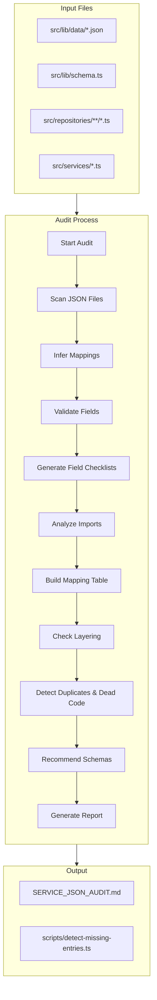

# Design Document: Service-JSON Audit System

## Overview

This design describes an automated audit system that validates the alignment between services, repositories, and JSON data files in a TypeScript/Next.js backend. The system performs static analysis to detect missing mappings, schema mismatches, naming inconsistencies, and layering violations.

The audit follows a structured approach:
1. Scan JSON data files in `src/lib/data/`
2. Infer related schema, repository, and service files
3. Validate field alignment between JSON and schemas
4. Detect import relationships and layering violations
5. Generate a structured Markdown report

### Current Codebase Structure

```
src/
├── lib/
│   ├── data/                    # JSON data files
│   │   ├── all-products.json
│   │   ├── brands.json
│   │   ├── categories.json
│   │   ├── companies.json
│   │   ├── customers.json
│   │   ├── form-submissions.json
│   │   ├── leads.json
│   │   ├── newsletter-subscribers.json
│   │   ├── placeholders.json
│   │   ├── quotes.json
│   │   └── users.json
│   ├── schema.ts               # TypeScript type definitions
│   └── prisma.ts               # Prisma client
├── repositories/
│   ├── static/                 # Static JSON repositories
│   │   ├── brandRepository.ts
│   │   ├── categoryRepository.ts
│   │   ├── companyRepository.ts
│   │   └── productRepository.ts
│   └── db/                     # Database repositories
│       ├── brandRepository.ts
│       ├── categoryRepository.ts
│       ├── companyRepository.ts
│       └── productRepository.ts
└── services/
    ├── productService.ts
    ├── categoryService.ts
    ├── brandService.ts
    └── ...
```

## Architecture



## Components and Interfaces

### 1. JSON Scanner

Scans `src/lib/data/` for JSON files and extracts metadata.

```typescript
interface JSONFileInfo {
  filename: string;           // e.g., "all-products.json"
  path: string;               // e.g., "src/lib/data/all-products.json"
  inferredModel: string;      // e.g., "Product"
  inferredTable: string;      // e.g., "products"
  recordCount: number;
  fields: string[];           // Union of all fields across records
  fieldConsistency: boolean;  // true if all records have same fields
}

interface JSONScanResult {
  files: JSONFileInfo[];
  totalFiles: number;
  totalRecords: number;
}
```

### 2. Path Inferrer

Infers related file paths based on naming conventions.

```typescript
interface InferredPaths {
  jsonFile: string;
  schemaFile: string;           // e.g., "src/lib/schema.ts"
  schemaType: string;           // e.g., "Product"
  staticRepoFile: string | null; // e.g., "src/repositories/static/productRepository.ts"
  dbRepoFile: string | null;     // e.g., "src/repositories/db/productRepository.ts"
  serviceFile: string | null;    // e.g., "src/services/productService.ts"
}

interface PathInferenceRules {
  // JSON filename → Model name
  // "all-products.json" → "Product"
  // "users.json" → "User"
  // "categories.json" → "Category"
  jsonToModel: (filename: string) => string;
  
  // Model name → Repository filename
  // "Product" → "productRepository.ts"
  modelToRepo: (model: string) => string;
  
  // Model name → Service filename
  // "Product" → "productService.ts"
  modelToService: (model: string) => string;
}
```

### 3. Field Validator

Validates JSON fields against schema definitions.

```typescript
interface FieldValidationResult {
  jsonFile: string;
  schemaType: string;
  schemaFields: SchemaField[];
  jsonFields: string[];
  missingRequired: string[];    // Required fields missing from JSON
  extraFields: string[];        // Fields in JSON not in schema
  typeMismatches: TypeMismatch[];
  isValid: boolean;
}

interface SchemaField {
  name: string;
  type: string;
  isOptional: boolean;
}

interface TypeMismatch {
  field: string;
  expectedType: string;
  actualType: string;
  recordIndex: number;
}
```

### 4. Import Analyzer

Analyzes import relationships between files.

```typescript
interface ImportAnalysis {
  file: string;
  imports: ImportInfo[];
  jsonImports: string[];        // JSON files imported
  repoImports: string[];        // Repository files imported
  serviceImports: string[];     // Service files imported
}

interface ImportInfo {
  source: string;               // Import path
  specifiers: string[];         // Named imports
  isDefault: boolean;
}

interface ImportGraph {
  nodes: string[];              // All files
  edges: ImportEdge[];          // Import relationships
  cycles: string[][];           // Detected circular imports
}

interface ImportEdge {
  from: string;
  to: string;
  type: 'json' | 'repo' | 'service' | 'schema' | 'other';
}
```

### 5. Layering Checker

Validates architectural layering rules.

```typescript
interface LayeringViolation {
  file: string;
  violationType: 'direct-json-in-service' | 'repo-imports-service' | 
                 'db-query-in-service' | 'schema-misplaced' | 'json-misplaced';
  description: string;
  recommendation: string;
}

interface LayeringCheckResult {
  violations: LayeringViolation[];
  isClean: boolean;
}
```

### 6. Duplicate Detector

Detects duplicate and unused artifacts, including redundant services and dead code.

```typescript
interface DuplicateInfo {
  type: 'json' | 'service' | 'repo';
  files: string[];
  similarity: number;           // 0-1 similarity score
  reason: string;
}

interface RedundantServiceInfo {
  services: string[];           // Service files with overlapping functionality
  overlappingFunctions: string[]; // Function names that do similar things
  similarity: number;           // 0-1 similarity score
  recommendation: string;       // Suggested consolidation action
}

interface UnusedInfo {
  type: 'json' | 'service' | 'repo' | 'function';
  file: string;
  name?: string;                // Function name if applicable
  reason: string;
}

interface DeadCodeInfo {
  file: string;
  type: 'unreachable-function' | 'unused-import' | 'orphaned-data-flow';
  name: string;                 // Function/import/variable name
  description: string;
  relatedDataFlow?: string;     // Related JSON/repo/service if applicable
}

interface DuplicateDetectionResult {
  duplicates: DuplicateInfo[];
  redundantServices: RedundantServiceInfo[];
  unused: UnusedInfo[];
  deadCode: DeadCodeInfo[];
}
```

### 7. Naming Validator

Validates naming consistency across layers.

```typescript
interface NamingValidation {
  jsonFile: string;
  expectedModelName: string;
  actualModelName: string | null;
  expectedRepoName: string;
  actualRepoName: string | null;
  expectedServiceName: string;
  actualServiceName: string | null;
  pluralizationConsistent: boolean;
  issues: NamingIssue[];
}

interface NamingIssue {
  type: 'mismatch' | 'ambiguous' | 'inconsistent-plural';
  description: string;
  expected: string;
  actual: string;
}
```

### 8. Mapping Table Generator

Generates the complete data flow mapping from services to JSON files.

```typescript
interface DataFlowMapping {
  service: string;              // e.g., "productService.ts"
  repository: string | null;    // e.g., "productRepository.ts"
  jsonFile: string | null;      // e.g., "all-products.json"
  schema: string | null;        // e.g., "Product"
  isComplete: boolean;          // true if all layers present
  violations: string[];         // Any layering violations in this flow
}

interface MappingTableResult {
  mappings: DataFlowMapping[];
  completeFlows: number;
  incompleteFlows: number;
  orphanedServices: string[];   // Services with no data source
  orphanedRepos: string[];      // Repos not used by any service
}
```

**Design Decision**: The mapping table provides a complete view of data flow through the architecture, making it easy to identify gaps where services don't have proper repository backing or where JSON files are accessed directly.

### 9. Required Fields Checklist Generator

Generates a checklist of required fields per JSON data file based on schema analysis.

```typescript
interface RequiredFieldsChecklist {
  jsonFile: string;
  schemaType: string | null;
  requiredFields: string[];
  optionalFields: string[];
  presentFields: string[];
  missingRequired: string[];
  coverage: number;             // 0-1 percentage of required fields present
}

interface FieldsChecklistResult {
  checklists: RequiredFieldsChecklist[];
  totalJsonFiles: number;
  filesWithFullCoverage: number;
  filesWithMissingFields: number;
}
```

**Design Decision**: This component addresses Requirement 2.5 by producing an explicit checklist that can be used to verify data completeness across all JSON files.

### 10. Schema Recommendation Engine

Recommends schema creation for JSON files without corresponding schemas.

```typescript
interface SchemaRecommendation {
  jsonFile: string;
  inferredTypeName: string;
  inferredFields: InferredField[];
  suggestedSchemaPath: string;
  suggestedSchemaCode: string;  // Generated TypeScript interface
  confidence: number;           // 0-1 confidence in inference
}

interface InferredField {
  name: string;
  inferredType: string;         // 'string' | 'number' | 'boolean' | 'object' | 'array'
  isNullable: boolean;
  sampleValues: unknown[];      // Up to 3 sample values
}

interface SchemaRecommendationResult {
  recommendations: SchemaRecommendation[];
  filesWithoutSchema: number;
  filesWithSchema: number;
}
```

**Design Decision**: When no schema exists for a JSON file (Requirement 4.3), the system analyzes the JSON structure and generates a recommended TypeScript interface, reducing manual effort in schema creation.

### 11. Report Generator

Generates the final Markdown audit report.

```typescript
interface AuditReport {
  inventory: InventoryEntry[];
  mappingTable: DataFlowMapping[];
  requiredFieldsChecklists: RequiredFieldsChecklist[];
  schemaRecommendations: SchemaRecommendation[];
  duplicatesUnused: DuplicatesUnusedSection;
  structuralIssues: StructuralIssue[];
  actionableFixes: ActionableFix[];
}

interface InventoryEntry {
  jsonFile: string;
  inferredTable: string;
  schemaFile: string;
  repositoryFile: string;
  serviceFile: string;
  status: 'OK' | 'Missing_Schema' | 'Missing_Repo' | 'Missing_Service' | 'Unused_JSON';
}

interface DuplicatesUnusedSection {
  duplicateJsonFiles: DuplicateInfo[];
  duplicateServices: RedundantServiceInfo[];
  unusedArtifacts: UnusedInfo[];
  deadCode: DeadCodeInfo[];
}

interface StructuralIssue {
  type: 'layering' | 'naming' | 'placement' | 'circular';
  severity: 'error' | 'warning' | 'info';
  file: string;
  description: string;
  recommendation: string;
}

interface ActionableFix {
  priority: 'high' | 'medium' | 'low';
  category: string;
  description: string;
  steps: string[];
  affectedFiles: string[];
}
```

## Data Models

### JSON File Naming Conventions

| JSON Filename | Inferred Model | Inferred Table | Expected Repo | Expected Service |
|---------------|----------------|----------------|---------------|------------------|
| all-products.json | Product | products | productRepository | productService |
| brands.json | Brand | brands | brandRepository | brandService |
| categories.json | Category | categories | categoryRepository | categoryService |
| companies.json | Company | companies | companyRepository | companyService |
| customers.json | Customer | customers | customerRepository | customerService |
| users.json | User | users | userRepository | userService |
| quotes.json | Quote | quotes | quoteRepository | quoteService |
| leads.json | Lead | leads | leadRepository | leadService |
| form-submissions.json | FormSubmission | form_submissions | formSubmissionRepository | formSubmissionService |
| newsletter-subscribers.json | NewsletterSubscriber | newsletter_subscribers | newsletterSubscriberRepository | newsletterService |
| placeholders.json | Placeholder | placeholders | placeholderRepository | placeholderService |

### Required Fields Per JSON File

Based on schema analysis, each JSON file should contain these required fields:

```typescript
const requiredFieldsMap: Record<string, string[]> = {
  'all-products.json': ['id', 'sku', 'name', 'slug', 'brand', 'category'],
  'brands.json': ['id', 'name', 'slug'],
  'categories.json': ['id', 'name', 'slug'],
  'companies.json': ['id', 'name'],
  'customers.json': ['id', 'email'],
  'users.json': ['id', 'email', 'role'],
  'quotes.json': ['id', 'userId', 'status'],
  'leads.json': ['id', 'email'],
  'form-submissions.json': ['id', 'formType', 'data'],
  'newsletter-subscribers.json': ['id', 'email'],
  'placeholders.json': ['id', 'type'],
};
```

## Correctness Properties

*A property is a characteristic or behavior that should hold true across all valid executions of a system—essentially, a formal statement about what the system should do. Properties serve as the bridge between human-readable specifications and machine-verifiable correctness guarantees.*

### Property 1: JSON File Discovery Completeness

*For any* directory containing JSON files, when the scanner runs, it SHALL discover all files with `.json` extension and correctly extract their filenames and paths.

**Validates: Requirements 1.1**

### Property 2: Path Inference Consistency

*For any* JSON filename following naming conventions, the path inferrer SHALL produce consistent schema, repository, and service paths that follow the established naming patterns (e.g., `products.json` → `Product` type → `productRepository.ts` → `productService.ts`).

**Validates: Requirements 1.2, 1.3, 1.4**

### Property 3: Status Classification Correctness

*For any* JSON file and combination of existing/missing related files (schema, repository, service), the status classifier SHALL return exactly one of: OK, Missing_Schema, Missing_Repo, Missing_Service, or Unused_JSON based on the file existence matrix.

**Validates: Requirements 1.5**

### Property 4: Field Extraction Completeness

*For any* valid JSON array of objects, the field extractor SHALL return the union of all field names present across all records in the array.

**Validates: Requirements 2.1**

### Property 5: Field Comparison Correctness

*For any* set of schema fields and JSON fields, the field comparator SHALL correctly identify:
- Missing required fields: schema required fields not present in JSON
- Extra fields: JSON fields not present in schema

**Validates: Requirements 2.2, 2.3**

### Property 6: Field Consistency Detection

*For any* JSON array where records have different field sets, the consistency checker SHALL detect and report the inconsistency with specific record indices.

**Validates: Requirements 2.4**

### Property 7: Import Detection Accuracy

*For any* TypeScript file with import statements, the import analyzer SHALL correctly extract all imported JSON files and module references.

**Validates: Requirements 3.1, 3.2**

### Property 8: Layering Violation Detection

*For any* service file that directly imports a JSON file (bypassing repository), the layering checker SHALL flag this as a violation.

**Validates: Requirements 3.4, 8.1**

### Property 9: Unused Repository Detection

*For any* repository file that is not imported by any service file in the codebase, the unused detector SHALL flag it as potentially unused.

**Validates: Requirements 3.5, 6.3**

### Property 10: Schema Validation Correctness

*For any* JSON record and corresponding schema definition, the validator SHALL correctly identify type mismatches between expected and actual field types.

**Validates: Requirements 4.1, 4.2, 4.4**

### Property 11: Missing Entry Detection

*For any* set of expected entries (by configurable key) and actual JSON entries, the missing entry detector SHALL correctly identify entries present in expected but absent in actual.

**Validates: Requirements 5.2, 5.3, 5.4**

### Property 12: Duplicate Content Detection

*For any* two JSON files with identical or highly overlapping content (>90% similarity), the duplicate detector SHALL flag them as duplicates.

**Validates: Requirements 6.1**

### Property 13: Unused JSON Detection

*For any* JSON file that is not imported by any TypeScript file in the codebase, the unused detector SHALL flag it as unused.

**Validates: Requirements 6.4**

### Property 14: Naming Consistency Validation

*For any* JSON filename, the naming validator SHALL verify that the corresponding schema type, repository name, and service name follow consistent naming conventions and pluralization rules.

**Validates: Requirements 7.1, 7.2, 7.3, 7.4**

### Property 15: Circular Import Detection

*For any* import graph with cycles, the cycle detector SHALL identify all circular import chains.

**Validates: Requirements 8.2**

### Property 16: File Placement Validation

*For any* file in the codebase, the placement validator SHALL flag:
- DB queries (Prisma calls) in service files
- Schema definitions outside `src/lib/` or `src/types/`
- JSON data files outside `src/lib/data/`

**Validates: Requirements 8.3, 8.4, 8.5**

### Property 17: Required Fields Checklist Generation

*For any* JSON file with a corresponding schema, the checklist generator SHALL produce a complete list of required fields, optional fields, and identify which required fields are missing from the JSON data.

**Validates: Requirements 2.5**

### Property 18: Data Flow Mapping Completeness

*For any* service file in the codebase, the mapping table generator SHALL trace its data flow through repositories to JSON files and schemas, producing a complete mapping entry.

**Validates: Requirements 3.3**

### Property 19: Schema Recommendation Accuracy

*For any* JSON file without a corresponding schema, the recommendation engine SHALL analyze the JSON structure and generate a valid TypeScript interface that accurately represents the data types present in the file.

**Validates: Requirements 4.3**

### Property 20: Redundant Service Detection

*For any* two service files with >80% overlapping function signatures or similar data access patterns, the duplicate detector SHALL flag them as potentially redundant.

**Validates: Requirements 6.2**

### Property 21: Dead Code Detection

*For any* function in a service or repository that is never called from any other file in the codebase, the dead code detector SHALL flag it as potentially dead code related to data flows.

**Validates: Requirements 6.5**

## Error Handling

### File System Errors

| Error Scenario | Handling Strategy |
|----------------|-------------------|
| JSON file not found | Log warning, continue with other files |
| Invalid JSON syntax | Log error with line number, skip file |
| Permission denied | Log error, skip file |
| Directory not found | Log error, return empty result |

### Schema Parsing Errors

| Error Scenario | Handling Strategy |
|----------------|-------------------|
| TypeScript parse error | Log error, skip schema validation |
| Zod schema not found | Log warning, recommend creating schema |
| Type not exported | Log warning, attempt to find internal type |

### Import Analysis Errors

| Error Scenario | Handling Strategy |
|----------------|-------------------|
| Circular import detected | Log warning, continue analysis |
| Dynamic import | Log info, note as unanalyzable |
| Missing module | Log warning, mark as broken import |

## Testing Strategy

### Unit Tests

Unit tests will verify specific examples and edge cases:

1. **JSON Scanner Tests**
   - Test scanning empty directory
   - Test scanning directory with mixed file types
   - Test field extraction from nested objects

2. **Path Inferrer Tests**
   - Test standard naming conventions
   - Test edge cases (hyphenated names, prefixed names)
   - Test pluralization rules

3. **Field Validator Tests**
   - Test with matching fields
   - Test with missing required fields
   - Test with extra fields
   - Test type mismatch detection

4. **Import Analyzer Tests**
   - Test ES6 imports
   - Test CommonJS requires
   - Test dynamic imports

5. **Mapping Table Generator Tests**
   - Test complete data flow mapping
   - Test orphaned services detection
   - Test orphaned repositories detection

6. **Schema Recommendation Tests**
   - Test type inference from JSON values
   - Test nullable field detection
   - Test generated TypeScript interface validity

7. **Dead Code Detector Tests**
   - Test unreachable function detection
   - Test unused import detection
   - Test orphaned data flow detection

### Property-Based Tests

Property-based tests will use fast-check for TypeScript to verify universal properties:

1. **Path Inference Property Test**
   - Generate random valid JSON filenames
   - Verify inferred paths follow consistent patterns
   - Minimum 100 iterations

2. **Field Comparison Property Test**
   - Generate random schema field sets and JSON field sets
   - Verify missing/extra field detection is correct
   - Minimum 100 iterations

3. **Import Detection Property Test**
   - Generate random TypeScript files with imports
   - Verify all imports are correctly extracted
   - Minimum 100 iterations

4. **Naming Consistency Property Test**
   - Generate random entity names
   - Verify naming transformations are reversible
   - Minimum 100 iterations

5. **Data Flow Mapping Property Test**
   - Generate random service/repo/JSON combinations
   - Verify complete mapping trace is produced
   - Minimum 100 iterations

6. **Schema Recommendation Property Test**
   - Generate random JSON objects with various types
   - Verify generated TypeScript interface is valid
   - Minimum 100 iterations

### Test Configuration

```typescript
import * as fc from 'fast-check';

describe('Path Inference Property', () => {
  it('should consistently infer paths from JSON filenames', () => {
    fc.assert(
      fc.property(
        fc.stringOf(fc.constantFrom(...'abcdefghijklmnopqrstuvwxyz-'.split('')), { minLength: 1, maxLength: 20 }),
        (baseName) => {
          const jsonFile = `${baseName}.json`;
          const paths = inferPaths(jsonFile);
          
          // Verify consistency
          return (
            paths.schemaType === toModelName(baseName) &&
            paths.staticRepoFile?.includes(toRepoName(baseName)) &&
            paths.serviceFile?.includes(toServiceName(baseName))
          );
        }
      ),
      { numRuns: 100 }
    );
  });
});

// Feature: service-json-audit, Property 2: Path Inference Consistency
// Validates: Requirements 1.2, 1.3, 1.4

describe('Data Flow Mapping Property', () => {
  it('should produce complete mapping for any service', () => {
    fc.assert(
      fc.property(
        fc.record({
          serviceName: fc.stringOf(fc.constantFrom(...'abcdefghijklmnopqrstuvwxyz'.split('')), { minLength: 3, maxLength: 15 }),
          hasRepo: fc.boolean(),
          hasJson: fc.boolean(),
          hasSchema: fc.boolean()
        }),
        (config) => {
          const mapping = generateMapping(config);
          
          // Verify mapping completeness
          return (
            mapping.service !== null &&
            mapping.isComplete === (config.hasRepo && config.hasJson && config.hasSchema)
          );
        }
      ),
      { numRuns: 100 }
    );
  });
});

// Feature: service-json-audit, Property 18: Data Flow Mapping Completeness
// Validates: Requirements 3.3
```
