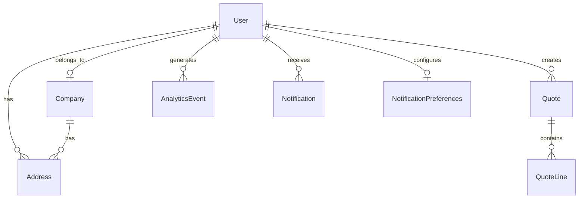

# Design Document: User Dashboard Schema

## Overview

This design document outlines the Prisma schema structure required to support the User Dashboard and User Settings features. After analyzing the existing schema against the design documents, the current schema is well-aligned with requirements. This document serves as a reference for the schema structure and identifies any minor enhancements needed.

## Architecture

The schema follows a relational model with PostgreSQL as the database provider. Key entities are organized into logical groups:

1. **Authentication & User Management** - User, Company, Address
2. **Analytics & Tracking** - AnalyticsEvent, ProductView, SearchQuery
3. **Notifications** - Notification, NotificationPreferences
4. **Quotes** - Quote, QuoteLine, QuoteMessage



## Components and Interfaces

### User Model (Existing - Complete)

The User model already contains all required fields for dashboard and settings:

```prisma
model User {
  id                     Int       @id @default(autoincrement())
  email                  String    @unique
  password               String
  firstName              String?   // Profile: first name
  lastName               String?   // Profile: last name
  phone                  String?   // Profile: contact number
  role                   UserRole  @default(CUSTOMER)
  emailVerified          DateTime? // Verification status
  isActive               Boolean   @default(true) // Account status
  lastLogin              DateTime? // Activity tracking
  createdAt              DateTime  @default(now())
  updatedAt              DateTime  @updatedAt
  company                Company?  @relation(fields: [companyId], references: [id])
  companyId              Int?
  addresses              Address[]
  quotes                 Quote[]
  analyticsEvents        AnalyticsEvent[]
  notifications          Notification[]
  notificationPrefs      NotificationPreferences?

  @@index([role])
  @@index([isActive])
  @@index([createdAt])
  @@map("users")
}
```

### Address Model (Existing - Complete)

Supports both billing and shipping addresses with default marking:

```prisma
model Address {
  id         Int         @id @default(autoincrement())
  type       AddressType @default(BILLING)  // BILLING | SHIPPING
  street     String
  city       String
  state      String
  postalCode String
  country    String      @default("Nigeria")
  isDefault  Boolean     @default(false)
  createdAt  DateTime    @default(now())
  updatedAt  DateTime    @updatedAt
  user       User?       @relation(fields: [userId], references: [id])
  userId     Int?
  company    Company?    @relation(fields: [companyId], references: [id])
  companyId  Int?

  @@map("addresses")
}
```

### Company Model (Existing - Complete)

Full business information support:

```prisma
model Company {
  id                 Int       @id @default(autoincrement())
  name               String
  registrationNumber String?
  taxId              String?
  industry           String?
  website            String?
  description        String?
  logo               String?
  isVerified         Boolean   @default(false)
  createdAt          DateTime  @default(now())
  updatedAt          DateTime  @updatedAt
  users              User[]
  addresses          Address[]

  @@map("companies")
}
```

### AnalyticsEvent Model (Existing - Complete)

Flexible event tracking with JSON metadata:

```prisma
model AnalyticsEvent {
  id        Int      @id @default(autoincrement())
  eventType String   // Event type identifier
  eventData Json?    // Event-specific metadata
  ipAddress String?
  userAgent String?
  createdAt DateTime @default(now())
  user      User?    @relation(fields: [userId], references: [id])
  userId    Int?

  @@index([eventType])
  @@index([userId])
  @@index([createdAt])
  @@map("analytics_events")
}
```

### NotificationPreferences Model (Existing - Complete)

User notification settings:

```prisma
model NotificationPreferences {
  id                 Int      @id @default(autoincrement())
  emailNotifications Boolean  @default(true)
  quoteUpdates       Boolean  @default(true)
  marketingEmails    Boolean  @default(false)
  createdAt          DateTime @default(now())
  updatedAt          DateTime @updatedAt
  user               User     @relation(fields: [userId], references: [id])
  userId             Int      @unique

  @@map("notification_preferences")
}
```

## Data Models

### Event Types for Activity Tracking

The AnalyticsEvent model supports these event types for the dashboard:

| Event Type | Description | Metadata Fields |
|------------|-------------|-----------------|
| `quote_requested` | User submitted a quote | `{ reference, productCount }` |
| `checkout_completed` | User completed checkout | `{ totalAmount, itemCount }` |
| `product_viewed` | User viewed a product | `{ productId, sku, name }` |
| `search_performed` | User searched | `{ query, resultCount }` |
| `form_submitted` | User submitted a form | `{ formType }` |
| `newsletter_signup` | User subscribed | `{ source }` |
| `user_registered` | New user registration | `{ method }` |
| `profile_updated` | Profile changes | `{ fields: string[] }` |
| `address_created` | New address added | `{ addressId, type }` |
| `address_updated` | Address modified | `{ addressId }` |
| `address_deleted` | Address removed | `{ addressId }` |
| `company_updated` | Company info changed | `{ companyId }` |
| `password_changed` | Password updated | `{ timestamp }` |

### Dashboard Query Patterns

The schema supports these optimized query patterns:

```typescript
// User profile with company
prisma.user.findUnique({
  where: { id: userId },
  include: { company: { select: { name: true } } },
});

// Quote statistics
prisma.quote.count({ where: { userId } });
prisma.quote.count({ 
  where: { userId, createdAt: { gte: startOfMonth } } 
});

// Activity statistics
prisma.analyticsEvent.count({ where: { userId } });
prisma.analyticsEvent.count({ 
  where: { userId, eventType: 'checkout_completed' } 
});

// Recent activity feed
prisma.analyticsEvent.findMany({
  where: { userId },
  orderBy: { createdAt: 'desc' },
  take: 10,
});
```

## Correctness Properties

*A property is a characteristic or behavior that should hold true across all valid executions of a system-essentially, a formal statement about what the system should do. Properties serve as the bridge between human-readable specifications and machine-verifiable correctness guarantees.*

### Property 1: User-Address Ownership Integrity

*For any* Address record with a non-null userId, there SHALL exist a corresponding User record with that id, ensuring referential integrity is maintained.

**Validates: Requirements 2.4**

### Property 2: Unique Default Address Per Type

*For any* User and AddressType combination, there SHALL be at most one Address marked as `isDefault = true`, ensuring users have a single default per address type.

**Validates: Requirements 2.3**

### Property 3: NotificationPreferences Uniqueness

*For any* User, there SHALL be at most one NotificationPreferences record, enforced by the unique constraint on userId.

**Validates: Requirements 5.4**

### Property 4: AnalyticsEvent User Association

*For any* AnalyticsEvent with a non-null userId, the referenced User SHALL exist, and the event SHALL be retrievable via the user's analyticsEvents relation.

**Validates: Requirements 4.3**

### Property 5: Quote-User Ownership

*For any* Quote record, the userId SHALL reference an existing User, and the quote SHALL appear in that user's quotes relation.

**Validates: Requirements 6.1**

### Property 6: Index Coverage for Dashboard Queries

*For any* dashboard query pattern (user stats, activity feed, quote counts), the query SHALL utilize defined indexes on `userId`, `createdAt`, `eventType`, and `status` fields.

**Validates: Requirements 7.1, 7.2, 7.3, 7.4**

## Error Handling

### Database Constraint Violations

| Constraint | Error Scenario | Handling |
|------------|----------------|----------|
| User.email unique | Duplicate email registration | Return "Email already exists" error |
| Address foreign key | Invalid userId | Prisma throws P2003 foreign key error |
| NotificationPreferences unique userId | Duplicate preferences | Use upsert pattern |
| Quote.reference unique | Duplicate reference | Generate new reference |

### Cascade Behavior

The schema uses default Prisma cascade behavior:
- Deleting a User does NOT cascade to related records (addresses, quotes, events)
- This is intentional for data retention and audit purposes
- Soft delete via `isActive = false` is preferred

## Testing Strategy

### Unit Tests

1. **Model Validation Tests**
   - Test User creation with required fields
   - Test Address type enum values
   - Test NotificationPreferences defaults

2. **Relationship Tests**
   - Test User-Company association
   - Test User-Address one-to-many
   - Test User-NotificationPreferences one-to-one

### Property-Based Tests

Property tests should use a library like `fast-check` for TypeScript:

1. **Property 1 Test**: Generate random addresses, verify user exists
2. **Property 2 Test**: Generate multiple addresses, verify single default per type
3. **Property 3 Test**: Attempt duplicate preferences, verify constraint
4. **Property 4 Test**: Generate events, verify user relation
5. **Property 5 Test**: Generate quotes, verify user ownership
6. **Property 6 Test**: Run dashboard queries, verify index usage via EXPLAIN

### Integration Tests

1. **Dashboard Data Fetch**: Test `getUserDashboardData()` returns correct structure
2. **Settings Update Flow**: Test profile, address, company updates
3. **Activity Tracking**: Test event creation and retrieval

## Schema Verification Summary

After analysis, the current Prisma schema at `prisma/schema.prisma` is **fully compatible** with the User Dashboard and User Settings design documents:

| Feature | Schema Support | Status |
|---------|---------------|--------|
| User profile fields | firstName, lastName, phone, lastLogin | ✅ Complete |
| Address management | Address model with type, isDefault | ✅ Complete |
| Company information | Company model with all fields | ✅ Complete |
| Analytics tracking | AnalyticsEvent with JSON eventData | ✅ Complete |
| Notification preferences | NotificationPreferences model | ✅ Complete |
| Quote statistics | Quote with userId, status indexes | ✅ Complete |
| Performance indexes | All required indexes present | ✅ Complete |

**No schema migrations are required.** The implementation can proceed using the existing schema.
